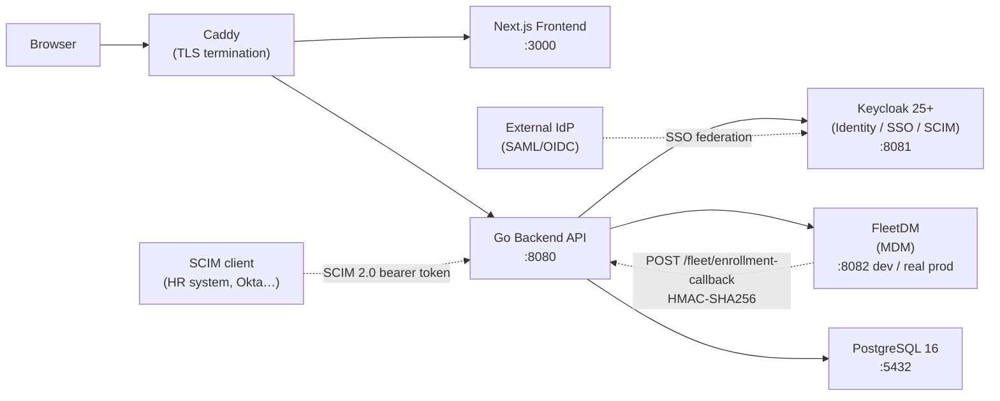

# FreeCloud Architecture

This document describes the system design, component responsibilities, data flows,
and security model for a self-hosted FreeCloud deployment.

## System Overview

FreeCloud is a unified identity and device management platform. It wraps two
proven open-source systems — **Keycloak** (identity, SSO, SCIM) and **FleetDM**
(MDM) — behind a single Go API and a Next.js dashboard.

The Go backend is the only service that talks to both Keycloak and FleetDM; no
other component does. The frontend is a standard Next.js (App Router) application
that authenticates users via Keycloak OIDC (Auth.js) and calls the backend API
with a JWT bearer token. Caddy terminates TLS in production and reverse-proxies to
the frontend and backend.

## System Topology



## Components

### Go Backend (`backend/`)

- **Language/framework:** Go 1.25+ with `go-chi/chi` router, `pgx/v5` for
  Postgres, `gocloak` for the Keycloak admin API, and `prometheus/client_golang`
  for metrics.
- **Entry point:** `backend/cmd/server/main.go`
- **Config:** `backend/internal/config/config.go` — all configuration via
  environment variables; fails closed in production (rejects insecure defaults).
- **Responsibilities:**
  - Onboarding / offboarding orchestration across Keycloak + FleetDM + Postgres.
  - Device posture evaluation for conditional access (`/api/v1/access/evaluate`).
  - SCIM 2.0 provisioning surface (`/scim/v2/Users`, `/scim/v2/Groups`).
  - Keycloak group/role management, MFA enforcement, access reviews.
  - FleetDM team and policy management.
  - Background jobs: Keycloak↔DB reconciliation, analytics snapshots, SIEM streaming.
  - Audit logging for every mutating operation.
- **Auth middleware stack:** JWT (Keycloak OIDC) → API token fallback →
  permission check → actor extraction. Rate limiting applied per-client (20
  mutations/min; separate limits for health/forgot-password).

### Next.js Frontend (`frontend/`)

- **Framework:** Next.js 16 (App Router), React 19, TypeScript, Tailwind CSS 4.
- **Auth:** Auth.js (next-auth) with the Keycloak OIDC provider. The access token
  is published into a module-level store (`frontend/src/lib/api.ts:setAuthToken`)
  and attached as a Bearer header on every API call.
- **API client:** `frontend/src/lib/api.ts` — typed wrapper over `fetch` with a
  standard `{ success, data, error, errors }` envelope.
- **Pages:** dashboard, employees, apps, groups, teams, compliance, audit log,
  settings, portal (self-service), analytics, access review campaigns.
- **Design tokens:** Tailwind CSS 4 with a v3-compat config (`tailwind.config.js`).
  Dark mode is class-based; toggled by the Sidebar and persisted to `localStorage`.
- **Security headers:** set by `next.config.js` (CSP, HSTS, X-Frame-Options, etc.).

### Keycloak

- Handles all authentication (OIDC/SAML), user federation, group/role management,
  and SCIM 2.0 provisioning (when a SCIM client pushes to the backend, the backend
  mirrors changes into Keycloak).
- The backend holds a confidential service-account client (`freecloud-service`,
  created by `make kc-setup`) with `manage-users` + `manage-clients` permissions.
- The frontend holds a separate public/confidential client (`freecloud-dashboard`)
  used by Auth.js for the end-user OIDC login flow.
- Keycloak admin tokens are cached until shortly before expiry (not re-fetched per
  call) to reduce latency and Keycloak load.

### FleetDM

- Manages device enrollment, MDM policies, software inventory, and posture data.
- In development the `fleetdm-mock` container (in `docker/fleetdm-mock/`) emulates
  the Fleet API and auto-fires the enrollment callback when both `BACKEND_URL` and
  `FLEET_WEBHOOK_SECRET` are set.
- In production, point `FLEET_URL` and `FLEET_API_TOKEN` at a real FleetDM
  instance. FleetDM must be configured to POST to `https://<api>/api/v1/fleet/enrollment-callback`
  with an HMAC-SHA256 `X-Fleet-Signature` header.

### PostgreSQL

- Single source of truth for user↔Keycloak ID mappings, enrollment tokens,
  device↔user mappings, app registrations, audit log, access policies, analytics
  snapshots, API tokens, and access review campaigns.
- Migrations are append-only (`backend/internal/db/schema.go`; never edit an
  applied migration).
- The backend runs migrations automatically on startup. Because there is no
  advisory lock, only one backend instance may run at a time (see
  [ADR 0003](adr/0003-single-instance.md)).

### Caddy (production only)

- Defined in `docker/docker-compose.prod.yml`.
- Three virtual hosts: dashboard, API, Keycloak — each gets a TLS certificate
  automatically (Let's Encrypt / ZeroSSL). All three DNS records must resolve to
  the host before first boot.
- `/metrics` is not exposed publicly by the default Caddyfile; expose it only on
  an internal network or behind authentication.

## Data Flows

### Onboarding

1. Admin submits the onboard form in the dashboard.
2. Frontend calls `POST /api/v1/onboard` with a JWT.
3. Backend performs an idempotency pre-check (returns `409` if the email already
   exists in the DB).
4. Backend creates the user in Keycloak and assigns the requested groups/roles.
5. Backend mints a FleetDM enrollment token.
6. **Single local transaction:** persists the user row, the enrollment token, and
   an audit log entry. If this transaction fails, a deferred compensation deletes
   the Keycloak user (saga-style rollback — see [ADR 0001](adr/0001-distributed-state-integrity.md)).
7. Backend returns the enrollment token and URL to the frontend.
8. Later: the employee's device enrolls in FleetDM, which calls
   `POST /api/v1/fleet/enrollment-callback` (HMAC signed). The backend resolves
   the token, links the device to the user, and consumes the token to prevent replay
   (see [ADR 0002](adr/0002-fleet-enrollment-callback.md)).

### Offboarding

1. Admin clicks the offboard button.
2. Frontend calls `POST /api/v1/offboard/{userId}`.
3. Backend disables the Keycloak account — **fails with `502`** if this step
   fails (fail-closed; the account is not reliably locked otherwise).
4. Backend terminates all active Keycloak sessions (best-effort).
5. Backend wipes all devices linked to the user in FleetDM (best-effort; reported
   in the response body).
6. Backend records the audit entry.

### Conditional Access (Device Posture)

1. User attempts to sign in to a protected application via Keycloak SSO.
2. A Keycloak Authenticator SPI calls `POST /api/v1/access/evaluate` (authenticated
   with `ACCESS_EVAL_TOKEN`).
3. Backend fetches the user's device posture from FleetDM and loads the per-app
   access policy from Postgres.
4. Backend evaluates: enrolled device required, disk encryption, and no critical
   vulnerabilities.
5. Returns `{ allowed: true }` or `{ allowed: false, failures: [...] }`.
6. Keycloak grants or denies the session; the frontend shows the access-blocked
   page on denial.

### Device Enrollment Callback

See [ADR 0002](adr/0002-fleet-enrollment-callback.md) for full rationale.

```
FleetDM → POST /api/v1/fleet/enrollment-callback
          X-Fleet-Signature: sha256=<HMAC-SHA256(body, FLEET_WEBHOOK_SECRET)>
          {"enrollment_token","host_id","hostname","os_version"}
```

The handler:
1. Verifies the HMAC signature (constant-time compare; rejects if secret unset).
2. Resolves the token (`404` unknown, `409` already used, `410` expired).
3. In one transaction: upserts the device row, inserts the `users_devices_mapping`
   row, and marks the token as consumed.

## Security Model

| Layer | Mechanism |
|---|---|
| Frontend auth | Auth.js + Keycloak OIDC; access token attached as `Bearer` on API calls |
| Backend API auth | JWT validation (issuer + audience + signature); API token fallback for service accounts |
| Permission model | Per-route `RequirePermission` middleware checks Keycloak realm roles in the JWT claims |
| SCIM provisioning | Dedicated `SCIM_BEARER_TOKEN`; constant-time compare |
| Access evaluation | Dedicated `ACCESS_EVAL_TOKEN`; constant-time compare |
| Fleet enrollment callback | HMAC-SHA256 over raw body keyed by `FLEET_WEBHOOK_SECRET`; unset secret rejects all callbacks |
| Transport | TLS enforced in production (Caddy); `sslmode=require` for Postgres; HSTS header |
| Fail-closed startup | `config.Validate()` rejects insecure defaults (dev DB URL, `sslmode=disable`, `admin-cli` client, empty secrets, localhost Keycloak) when `APP_ENV != development` |
| Audit log | Every mutating operation writes an immutable audit entry (actor, action, target, details) inside the same DB transaction |
| Request limits | 1 MiB body cap; per-client rate limiting (in-memory token bucket); no `RealIP` middleware to prevent header spoofing |
| Security response headers | `X-Content-Type-Options`, `X-Frame-Options`, `Referrer-Policy`, `HSTS` on every response; richer CSP on the frontend |
| Images | Backend: `distroless/nonroot`; Frontend: non-root node user |

## Database Schema Overview

The following tables are created by the append-only migration runner in
`backend/internal/db/schema.go`:

| Table | Purpose |
|---|---|
| `users` | Canonical user records with Keycloak user ID reference |
| `apps` | Registered SSO applications (OIDC or SAML) |
| `app_assignments` | User↔app assignments |
| `app_policies` | Per-app conditional access policies (posture requirements) |
| `audit_logs` | Immutable audit trail (actor, action, target, JSONB details) |
| `devices` | Enrolled devices indexed by Fleet host ID |
| `users_devices_mapping` | User↔device links (populated by enrollment callback) |
| `enrollment_tokens` | Short-lived tokens linking a Fleet enrollment to a user |
| `analytics_snapshots` | Time-series snapshots of compliance/enrollment KPIs |
| `api_tokens` | Long-lived service-account tokens (hashed; never stored in plain) |
| `groups` | Keycloak group metadata cache |
| `fleet_teams` | FleetDM team records |
| `access_review_campaigns` | Access review campaign metadata |
| `access_review_items` | Per-user/app items within a campaign |
| `access_requests` | Self-service app access requests from the portal |
| `schema_migrations` | Applied migration tracking |

## Configuration Reference

All configuration is via environment variables. See [docs/API.md](API.md) for the
full table. The canonical list of variables the backend reads is in
`backend/internal/config/config.go`.

**Required in production** (the backend refuses to start if any are missing or set
to insecure defaults):

| Variable | Description |
|---|---|
| `DATABASE_URL` | Postgres DSN — must not use `sslmode=disable` |
| `KEYCLOAK_URL` | Keycloak base URL (must not be localhost) |
| `KEYCLOAK_CLIENT_ID` | Confidential service-account client (not `admin-cli`) |
| `KEYCLOAK_CLIENT_SECRET` | Client secret for the service account |
| `KEYCLOAK_AUDIENCE` | Expected JWT `aud` claim |
| `FLEET_API_TOKEN` | FleetDM API token |
| `FLEET_WEBHOOK_SECRET` | HMAC key for the enrollment callback |
| `SCIM_BEARER_TOKEN` | Bearer token for inbound SCIM provisioning |
| `ACCESS_EVAL_TOKEN` | Bearer token for posture access-evaluation calls |
| `CORS_ORIGIN` | Allowed CORS origin for the frontend |

See `.env.prod.example` for the full set including Caddy public hostnames, SMTP,
Slack, Webhook, and SIEM variables.

## Single-Instance Constraint (v1)

FreeCloud v1 runs as a single backend process. The in-memory rate limiter and the
startup migration runner (no advisory lock) both assume a single instance. Running
two replicas against the same database risks migration races and bypasses rate
limits. See [ADR 0003](adr/0003-single-instance.md) for the full rationale and
what multi-instance would require.

## ADR Index

- [ADR 0001](adr/0001-distributed-state-integrity.md) — Distributed-state integrity
  (synchronous compensation / saga-style rollback for onboarding/offboarding)
- [ADR 0002](adr/0002-fleet-enrollment-callback.md) — FleetDM enrollment callback
  (HMAC-authenticated webhook; token single-use; device↔user linking)
- [ADR 0003](adr/0003-single-instance.md) — Single-instance constraint (in-memory
  rate limiter, no advisory-lock migrations)
